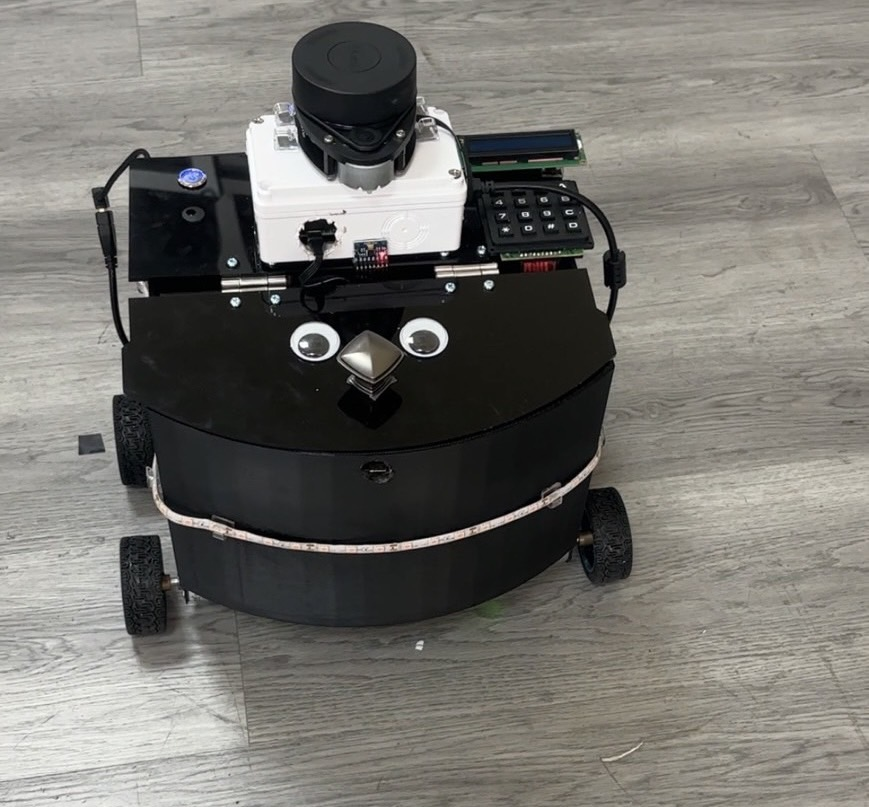

# Secure Drug Delivery Robot | Fourth-Year Capstone Project at KMITL

🔗 GitHub Repository: [ndoqx/Secure-Drug-Delivery-Robot](https://github.com/ndoqx/Secure-Drug-Delivery-Robot.git)

This project is a SLAM-based autonomous drug delivery robot with a built-in password-protected security system designed during my fourth year as a Biomedical Engineering student at KMITL. The robot is developed for hospital environments to reduce workload, automate logistics, and securely store and deliver medical supplies.

It integrates Simultaneous Localization and Mapping (SLAM) for autonomous navigation, a Linux-based interface (Raspberry Pi) for control, and a password-protected ESP32-based security system that restricts access to authorized personnel only.

---

# Device Images

## Assembled Robot with Lockable Drug Compartment




---

# Features

* Autonomous SLAM navigation using LiDAR + MPU6050
* Secure password-protected drug compartment (ESP32 + keypad + relay)
* Password verification and buzzer feedback
* Real-time LCD display status (locked/unlocked/wrong password)
* Audible confirmation for correct/incorrect access attempts
* Internal lighting activated upon unlocking for visibility
* Physical locking mechanism with manual override

---

# How It Works

1. The robot navigates autonomously using SLAM to deliver drugs.
2. Upon arrival, only authorized staff can open the compartment:

   * They must enter a 4-digit password on the keypad.
3. If the password is correct:

   * The **relay unlocks the solenoid lock**
   * A success **melody** plays
   * Internal light turns on
4. If incorrect:

   * A **single beep** notifies failed attempt
   * LCD displays an “Incorrect Password” warning
5. Pressing `#` while unlocked re-locks the system.

---

# Hardware Used

| Component         | Description                                              |
| ----------------- | -------------------------------------------------------- |
| ESP32             | Handles keypad input, display, buzzer, and relay         |
| 4x4 Matrix Keypad | For password entry                                       |
| Relay Module      | Controls the electric solenoid lock                      |
| Electric Lock     | Secures the drug compartment                             |
| LCD I2C Display   | Shows lock/unlock status and password input feedback     |
| Buzzer            | Audio feedback for access attempts                       |
| Internal Lights   | Activate on unlock for visibility inside the compartment |
| External Lights   | Signal the robot’s presence on the hallway               |
| Raspberry Pi      | Hosts SLAM system and Linux-based control                |
| LiDAR + MPU6050   | Provides real-time mapping and orientation data          |

---

# Wiring Overview

| Component      | ESP32 Pin           |
| -------------- | ------------------- |
| Buzzer         | GPIO 4              |
| Relay (Lock)   | GPIO 5              |
| LCD SDA / SCL  | GPIO 21 / 22        |
| Keypad Rows    | GPIO 32, 33, 25, 26 |
| Keypad Columns | GPIO 27, 14, 12, 13 |

---

# Code Overview

Main logic is in `Security Part of Slam Robot.ino`.
Key components:

* `updateDisplay()`: Updates LCD status (LOCKED, UNLOCKED, etc.)
* `playSuccessSound()`: Confirms correct password
* `playWrongPasswordSound()`: Alerts wrong input
* `updateRelay()`: Locks/unlocks the relay
* `loop()`: Manages keypad input and system state

---

# Installation & Usage

1. Clone the repository:

   ```bash
   git clone https://github.com/ndoqx/Secure-Drug-Delivery-Robot.git
   cd Secure-Drug-Delivery-Robot
   ```

2. Open `Security Part of Slam Robot.ino` in Arduino IDE.

3. Install required libraries:

   * `LiquidCrystal_I2C`
   * `Keypad`
   * `Buzzer`
   * `Wire` (built-in)

4. Upload to your ESP32 board.

5. On boot:

   * System starts in **LOCKED** state.
   * LCD prompts for password.
   * Use the keypad to unlock and access the drug compartment.

---

# Sample Output (Serial Monitor)

```
>>> LOCKED <<<
Enter Password:
Key Pressed: 0
Key Pressed: 0
Key Pressed: 0
Key Pressed: 0
Password correct, Relay is unlocked.
*** UNLOCKED ***
Press '#' to lock
```

---

# System Capabilities

* **Access Control**

  * Starts locked by default
  * Unlocks on correct 4-digit password
  * Manual re-locking with `#` key

* **User Feedback**

  * LCD messages for status and errors
  * Melody for correct access, beep for incorrect

* **Security**

  * All passwords validated before triggering hardware
  * Lock state remembered throughout user interaction
  * Unauthorized access blocked

* **Integration**

  * Security module integrated with SLAM delivery robot system
  * Internal lights, lid mechanism, and external alerts all synced

---

# Future Improvements

* Use RFID or biometric verification for added access control
* Store access logs to microSD or cloud (via WiFi)
* Battery backup for lock system in case of power loss
* Harden enclosure for hospital-grade reliability
* Integrate with hospital server for delivery requests

---

# Author

**Thanetpol Noynuai**
Biomedical Engineering, KMITL (4th Year Capstone Project)
🔗 GitHub: [@ndoqx](https://github.com/ndoqx)

---

# Disclaimer

This project is intended for educational and prototyping purposes only. It is **not certified for clinical or commercial use**. Please consult relevant standards and hospital IT security policies for production deployment.
